# ThesisAuxiliaryTools
工程实践课题，一个论文辅助工具，包括论文相似度分析、论文错别字识别、论文主题提取等功能，有一个微信小程序和一个后台管理系统；

[TOC]

## 一、前言
- 此项目是学院2018年末工程实践小组作品，比较简单，因为时间仅有2个月，所以很多好用的技术都没用上；

## 二、项目介绍
- 微信小程序：包括首页面、论文分析页面、查看历史界面、用户反馈等功能；论文分析包括三个功能：论文错别字纠正功能、论文句段相似度查询、论文主题提取等；
- 后台服务器：提供微信前端信息修改的信息管理页面，用于统计用户访问频度和系统性能的统计分析页面，用于管理用户和管理员信息的用户管理页面，用于设置管理系统和核心功能属性的设置页面；后台的三个功能使用Python开源库实现；

## 三、项目展示

### 1、后台管理系统
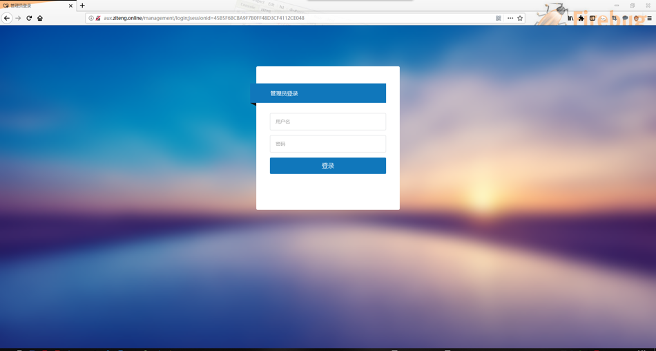
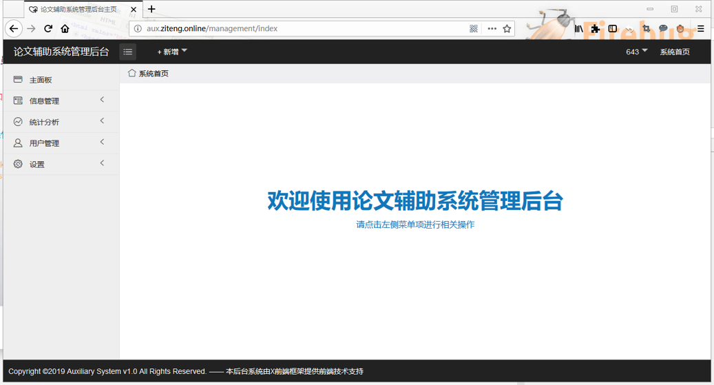
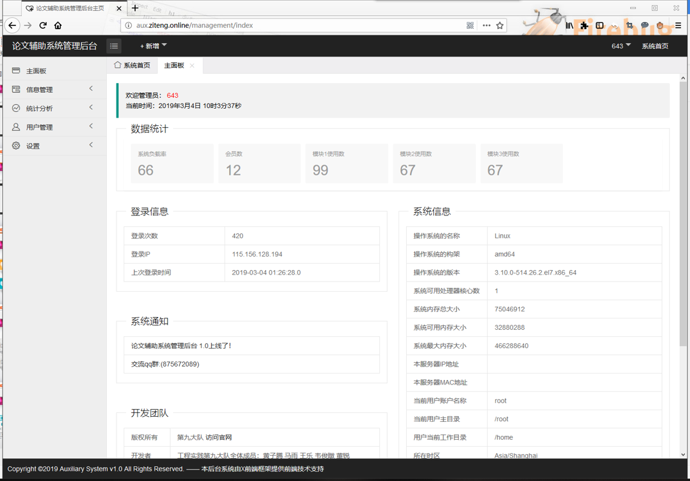
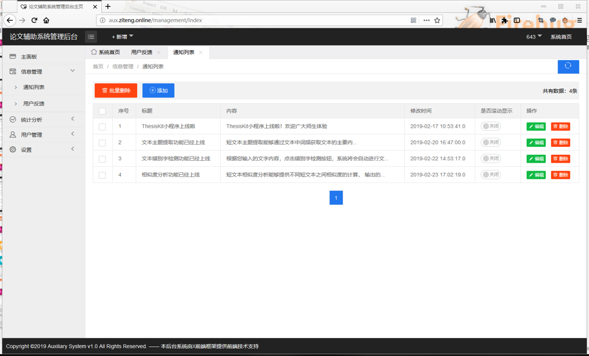
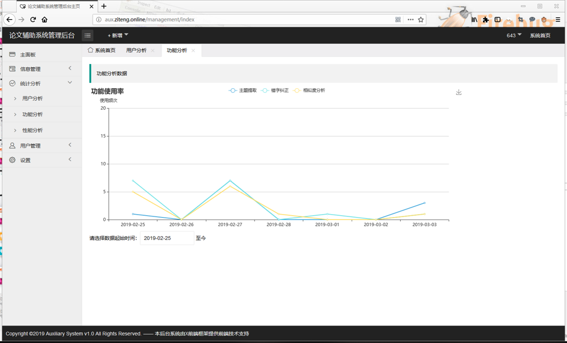
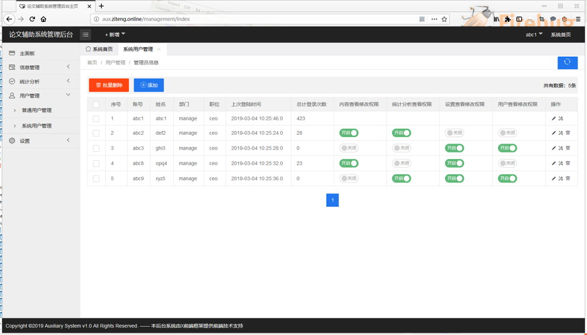      
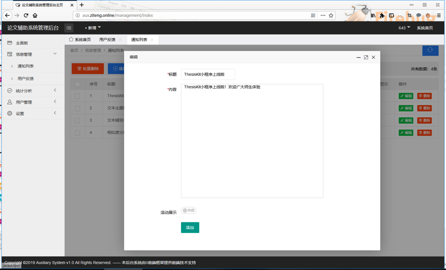

### 2、微信小程序
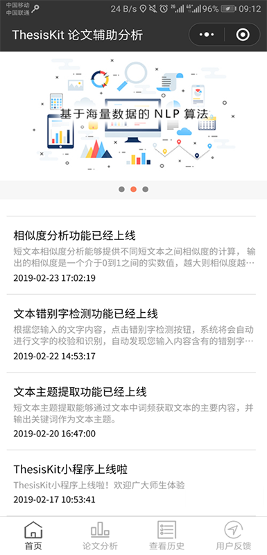
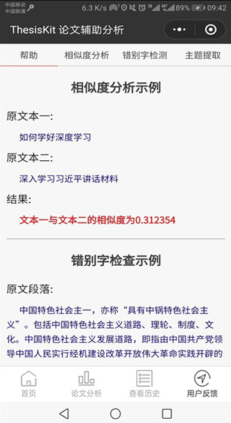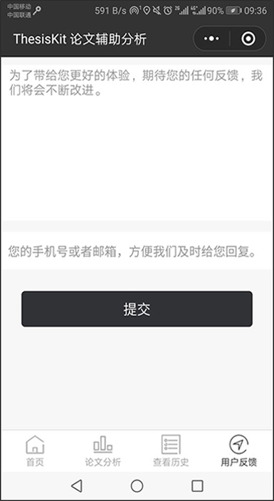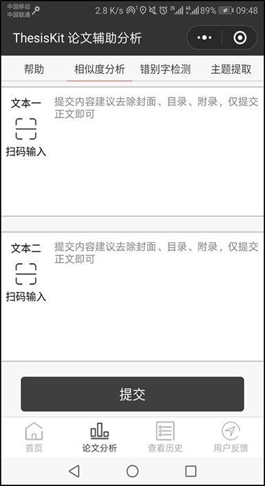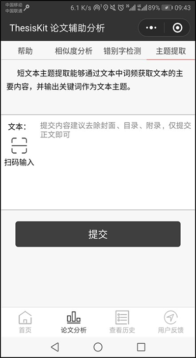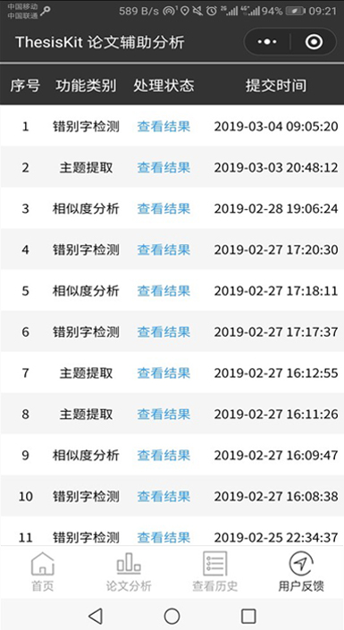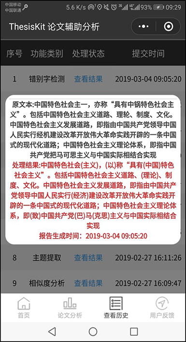

## 四、项目环境介绍
### 1、软硬件环境
1. 开发用的电脑
2. 一台VPS服务器，需要公网IP

### 2、开发工具
1. Python3.x执行环境
2. IntelliJ IDEA开发环境
3. Mariadb数据库
4. PyCharm 开发环境
5. 微信web开发者工具
6. Axure原型设计工具

## 五、系统设计
### 1、系统上下文定义
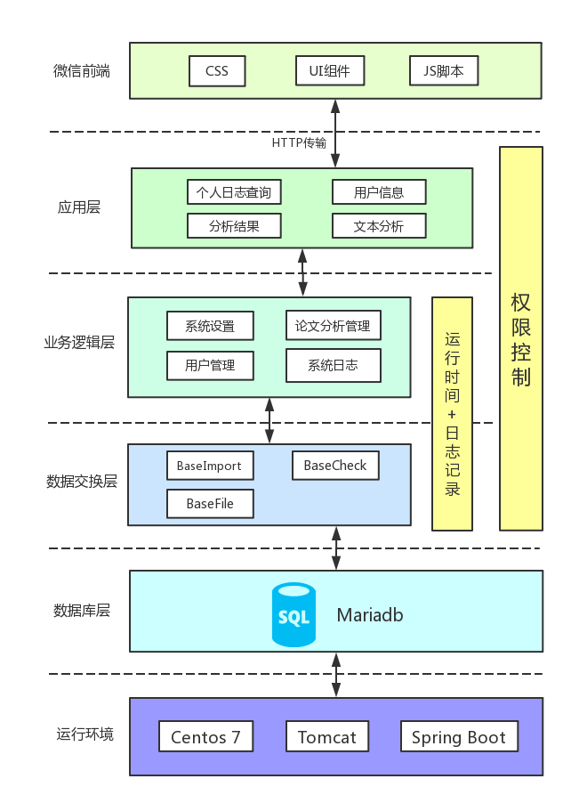

### 2、系统结构
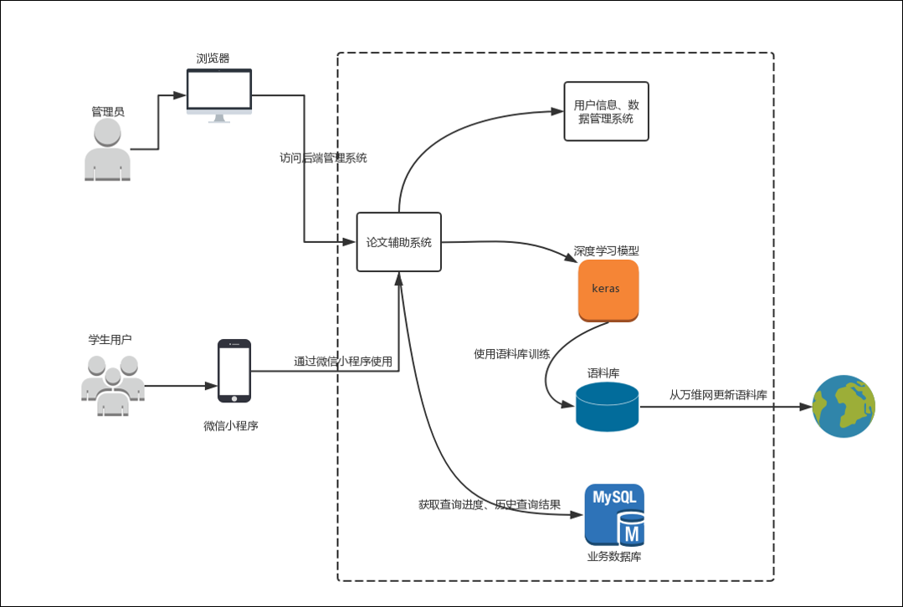

### 3、后台管理系统状态图
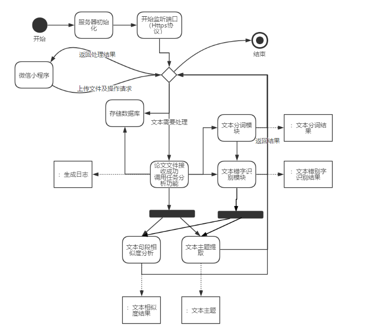

## 六、技术栈
### 1、前端所用技术
1. jQuery及Ajax
2. 使用了X-Admin管理系统前端框架
3. 使用了Thymeleaf模板引擎

### 2、后端所用技术
1. Spring、Spring MVC、Hibernate，及Spring的IOC和AOP
2. Spring JPA
3. log4j日记功能
4. Gensim框架
5. Keras框架
6. pycorrector模块

## 七、环境配置
### 1、本地测试
#### 1.1 服务器后台配置
1. 使用的是Window10系统，工具开发是Ideal和Pycharm，数据库用的是Mariadb，请配置好开发工具和数据库；
2. 使用Ideal打开`ThesisAuxiliaryTools\ssm_后台\auxiliary`下的工程；
3. 修改`src\main\resources`下的`application文件`，取消`active: localtest`注释，注释掉`active: deployment`这行；
4. 修改`src\main\resources`下的`application-localtest文件`，修改其中spring:datasource的`username和password为自己数据库的账号密码`；
5. 修改`src\main\java\com\paper\auxiliary\task`下的`AnalyseTask文件`，其中`第73行`SystemInfo.cpuUsageMin()改为任意0-100的数值，同理`75行`的SystemInfo.memoryUsageMin()也是，因为这两行代码只能在Linux下运行；
6. 将`ThesisAuxiliaryTools\基本环境搭建`下的Python_workplace文件夹复制到D盘，或者更改`application-localtest文件`的moduleconfig项的内容；
7. 在数据库中运行`ThesisAuxiliaryTools\基本环境搭建\数据库测试脚本`下的auxiliary_base.sql文件，此文件主要用于增加了基本的用户数据和配置参数；

### 2、 部署测试
#### 2.1 服务器后台配置
1. 使用的是Centos7系统，已安装mariadb和python3
2. 修改`src\main\resources`下的`application文件`，取消`active: deployment`注释，注释掉`active: localtest`这行；
3. 修改`src\main\resources`下的`application-deployment`，修改其中spring:datasource的`username和password为自己数据库的账号密码`；
4. 下载`ThesisAuxiliaryTools\基本环境搭建\prouse`下的文件，拷贝到服务器`/root`下，或者修改配置moduleconfig项的内容；
5. 修改配置moduleconfig项的python解释器名称，请使用Python3.x版本，建议在windows10上使用Pycharm远程连接服务器进行python脚本模块安装和调试

#### 2.2 微信小程序配置
1. 需要安装微信web开发者工具；
2. 使用测试号打开小程序工程；
3. 从微信公众平台获取自己的小程序AppID，添加到`index.js的45、46、47行`；
4. 编译并运行，使用手机测试；

### 3、正式部署
1. 本地生成部署版本的jar包，也可以使用war方式，不过有些麻烦
2. 传输到服务器，使用java命令运行jar包
